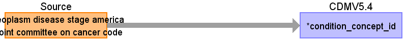

## Table name: condition_occurrence

### Reading from 0_coadread_tcga_pan_can_atlas_2018_clinical_data.tsv

| Destination Field | Source field | Logic | Comment field |
| --- | --- | --- | --- |
| condition_occurrence_id |  |  |  |
| person_id |  |  |  |
| condition_concept_id | neoplasm disease stage american joint committee on cancer code |  |  |
| condition_start_date |  |  |  |
| condition_start_datetime |  |  |  |
| condition_end_date |  |  |  |
| condition_end_datetime |  |  |  |
| condition_type_concept_id |  |  |  |
| condition_status_concept_id |  |  |  |
| stop_reason |  |  |  |
| provider_id |  |  |  |
| visit_occurrence_id |  |  |  |
| visit_detail_id |  |  |  |
| condition_source_value |  |  |  |
| condition_source_concept_id |  |  |  |
| condition_status_source_value |  |  |  |

