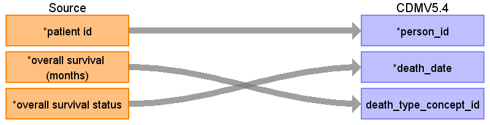

## Table name: death

### Reading from 0_coadread_tcga_pan_can_atlas_2018_clinical_data.tsv

| Destination Field | Source field | Logic | Comment field |
| --- | --- | --- | --- |
| person_id | patient id | Lookup person_id using Patient ID from PERSON table (person_source_value). Join on Patient ID to retrieve numeric person_id. |  |
| death_date | overall survival status | If [Overall Survival Status] = '1:DECEASED'  AND [Overall Survival (Months)] is not null  → create DEATH record  death_date = diagnosis_anchor + ROUND([Overall Survival (Months)] * 30.44)    diagnosis_anchor=2000-01-01 |  |
| death_datetime |  |  |  |
| death_type_concept_id | overall survival (months) | Set constant = 32817 ('EHR') |  |
| cause_concept_id |  |  | If [Disease-Specific Survival Status] = '1: DEAD WITH TUMOR'  code cause_concept_id = 321588 (Malignant neoplasm of colon)  Else NULL |
| cause_source_value |  |  | If [Disease-Specific Survival Status] = '1: DEAD WITH TUMOR'  code cause_source_value = 'Dead with tumor (disease-specific death)'  Else NULL |
| cause_source_concept_id |  |  |  |

