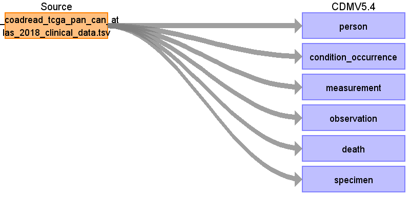

# Source Data Mapping Approach to CDMV5.4

## Contents

[person](person.md)

[condition_occurrence](condition_occurrence.md)

[measurement](measurement.md)

[observation](observation.md)

[death](death.md)

[specimen](specimen.md)

[source_appendix](source_appendix.md)

