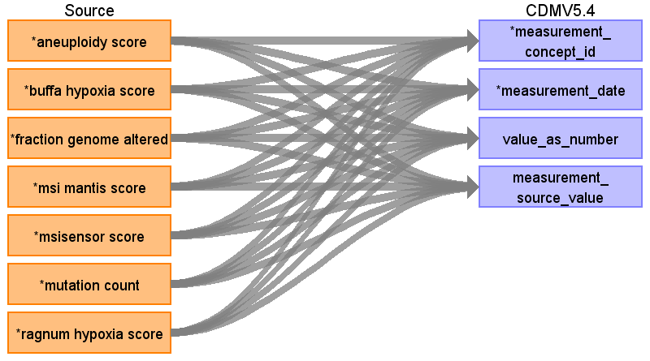

## Table name: measurement

### Reading from 0_coadread_tcga_pan_can_atlas_2018_clinical_data.tsv

| Destination Field | Source field | Logic | Comment field |
| --- | --- | --- | --- |
| measurement_id |  |  |  |
| person_id |  |  |  |
| measurement_concept_id | aneuploidy score buffa hypoxia score fraction genome altered ragnum hypoxia score msi mantis score msisensor score mutation count | measurement_concept_id = 0 measurement_concept_id = 0 measurement_concept_id = 0 measurement_concept_id = 0 measurement_concept_id = 0  measurement_concept_id = 0 |  |
| measurement_date | aneuploidy score buffa hypoxia score fraction genome altered ragnum hypoxia score msi mantis score msisensor score mutation count | measurement_date = diagnosis_anchor   diagnosis_anchor = DATE '2000-01-01'. measurement_date = diagnosis_anchor  diagnosis_anchor = DATE '2000-01-01'. measurement_date = diagnosis_anchor measurement_date = diagnosis_anchor  diagnosis_anchor = DATE '2000-01-01'. measurement_date = diagnosis_anchor  diagnosis_anchor = DATE '2000-01-01'. measurement_date = diagnosis_anchor   diagnosis_anchor = DATE '2000-01-01'. measurement_date = diagnosis_anchor |  |
| measurement_datetime |  |  |  |
| measurement_time |  |  |  |
| measurement_type_concept_id |  |  |  |
| operator_concept_id |  |  |  |
| value_as_number | aneuploidy score buffa hypoxia score fraction genome altered ragnum hypoxia score msi mantis score msisensor score mutation count | value_as_number = CAST([Aneuploidy Score] AS NUMERIC) value_as_number = CAST([Fraction Genome Altered] AS NUMERIC) value_as_number = CAST([Fraction Genome Altered] AS NUMERIC) value_as_number = CAST([Ragnum Hypoxia Score] AS NUMERIC) value_as_number = CAST([MSI Mantis Score] AS NUMERIC) value_as_number = CAST([MSIsensor Score] AS NUMERIC) value_as_number = CAST([Mutation Count] AS NUMERIC |  |
| value_as_concept_id |  |  |  |
| unit_concept_id |  |  |  |
| range_low |  |  |  |
| range_high |  |  |  |
| provider_id |  |  |  |
| visit_occurrence_id |  |  |  |
| visit_detail_id |  |  |  |
| measurement_source_value | aneuploidy score buffa hypoxia score fraction genome altered ragnum hypoxia score msi mantis score msisensor score mutation count | measurement_source_value = 'Aneuploidy Score' measurement_source_value = 'Buffa Hypoxia Score' value_as_number = CAST([Fraction Genome Altered] AS NUMERIC) measurement_source_value = 'Ragnum Hypoxia Score' measurement_source_value = 'MSI mantis Score' measurement_source_value = 'MSIsensor Score' measurement_source_value = 'Mutation Count' |  |
| measurement_source_concept_id |  |  |  |
| unit_source_value |  |  |  |
| unit_source_concept_id |  |  |  |
| value_source_value |  |  |  |
| measurement_event_id |  |  |  |
| meas_event_field_concept_id |  |  |  |

