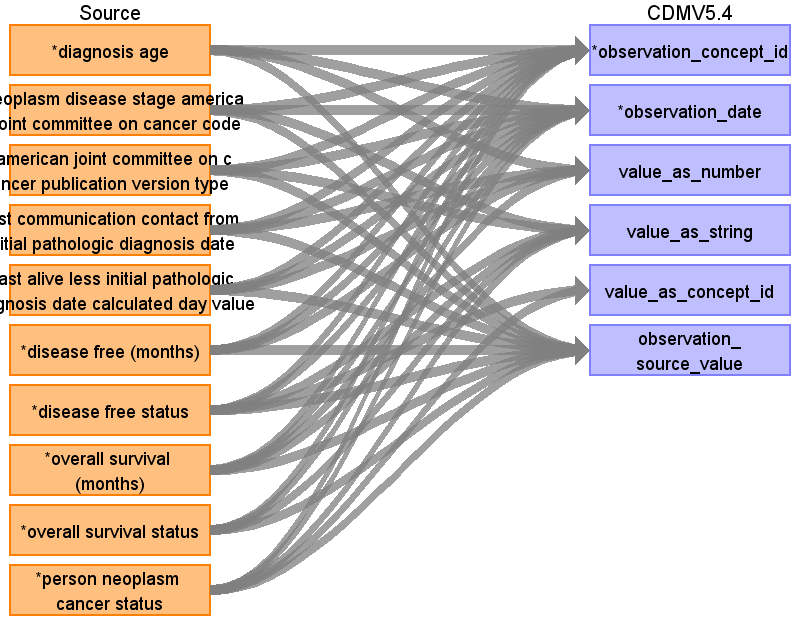

## Table name: observation

### Reading from 0_coadread_tcga_pan_can_atlas_2018_clinical_data.tsv

| Destination Field | Source field | Logic | Comment field |
| --- | --- | --- | --- |
| observation_id |  |  |  |
| person_id |  |  |  |
| observation_concept_id | diagnosis age neoplasm disease stage american joint committee on cancer code american joint committee on cancer publication version type person neoplasm cancer status last communication contact from initial pathologic diagnosis date last alive less initial pathologic diagnosis date calculated day value disease free (months) disease free status overall survival (months) overall survival status | observation_concept_id = 0 observation_concept_id = 0 observation_concept_id = 0 observation_concept_id = 0 observation_concept_id = 0 observation_concept_id = 0 observation_concept_id = 0 observation_concept_id = 0 observation_concept_id = 0 observation_concept_id = 0 |  |
| observation_date | diagnosis age neoplasm disease stage american joint committee on cancer code american joint committee on cancer publication version type person neoplasm cancer status last communication contact from initial pathologic diagnosis date last alive less initial pathologic diagnosis date calculated day value disease free (months) disease free status overall survival (months) overall survival status | observation_date = diagnosis_anchor (use fixed date 2000-01-01) observation_date = diagnosis_anchor (use fixed date 2000-01-01) observation_date = diagnosis_anchor (use fixed date 2000-01-01) observation_date = diagnosis_anchor (use fixed date 2000-01-01)+ [Last Communication Contact days] else diagnosis_anchor observation_date = diagnosis_anchor (use fixed date 2000-01-01) + CAST([Last Communication Contact from Initial Pathologic Diagnosis Date] AS INT) observation_date = diagnosis_anchor (use fixed date 2000-01-01) + CAST([Last Alive Less Initial Pathologic Diagnosis Date Calculated Day Value] AS INT) observation_date = diagnosis_anchor + ROUND([Disease Free (Months)] * 30.44)(if not NULL) observation_date = diagnosis_anchor observation_date = diagnosis_anchor + ROUND([Overall Survival (Months)] * 30.44) (if not NULL) observation_date = diagnosis_anchor |  |
| observation_datetime |  |  |  |
| observation_type_concept_id |  |  |  |
| value_as_number | diagnosis age last communication contact from initial pathologic diagnosis date last alive less initial pathologic diagnosis date calculated day value disease free (months) overall survival (months) | value_as_number = CAST([Diagnosis Age] AS INTEGER) value_as_number = CAST([Last Communication Contact from Initial Pathologic Diagnosis Date] AS INT) value_as_number = CAST([Last Alive Less Initial Pathologic Diagnosis Date Calculated Day Value] AS INT) value_as_number = CAST([Disease Free (Months)] AS NUMERIC) value_as_number = CAST([Overall Survival (Months)] AS NUMERIC) |  |
| value_as_string | neoplasm disease stage american joint committee on cancer code american joint committee on cancer publication version type person neoplasm cancer status disease free status overall survival (months) overall survival status | value_as_string = [Neoplasm Disease Stage American Joint Committee on Cancer Code] value_as_string = [American Joint Committee on Cancer Publication Version Type] value_as_string = original text value_as_string = original label in 'disease free status' value_as_string = [Overall Survival Status] value_as_string = [Overall Survival Status] |  |
| value_as_concept_id | person neoplasm cancer status disease free status | “With Tumor” coded as  value_as_concept_id = 4188539 (Yes)  “Tumor Free” coded as value_as_concept_id = 4188540 (No) “0:DiseaseFree” coded as  value_as_concept_id = 4188539 (Yes)  “1:[Recurrence/Not DF] coded as value_as_concept_id = 4188540 (No) |  |
| qualifier_concept_id |  |  |  |
| unit_concept_id |  |  |  |
| provider_id |  |  |  |
| visit_occurrence_id |  |  |  |
| visit_detail_id |  |  |  |
| observation_source_value | diagnosis age neoplasm disease stage american joint committee on cancer code american joint committee on cancer publication version type person neoplasm cancer status last communication contact from initial pathologic diagnosis date last alive less initial pathologic diagnosis date calculated day value disease free (months) disease free status overall survival (months) overall survival status | observation_source_value = 'Diagnosis Age' observation_source_value = 'Neoplasm Disease Stage American Joint Committee on Cancer Code' observation_source_value ='American Joint Committee on Cancer Publication Version Type' observation_source_value = 'Person Neoplasm Cancer Status' observation_source_value = 'Last Communication Contact from Initial Pathologic Diagnosis Date' observation_source_value = 'Last Alive Less Initial Pathologic Diagnosis Date Calculated Day Value' observation_source_value = 'Disease Free (Months)' observation_source_value = 'Disease Free Status' observation_source_value = 'Overall Survival Status' observation_source_value = 'Overall Survival Status' |  |
| observation_source_concept_id |  |  |  |
| unit_source_value |  |  |  |
| qualifier_source_value |  |  |  |
| value_source_value |  |  |  |
| observation_event_id |  |  |  |
| obs_event_field_concept_id |  |  |  |

