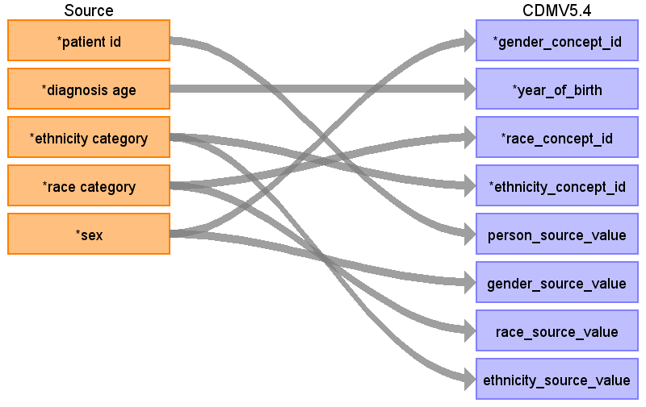

## Table name: person

### Reading from 0_coadread_tcga_pan_can_atlas_2018_clinical_data.tsv

| Destination Field | Source field | Logic | Comment field |
| --- | --- | --- | --- |
| person_id |  |  | Generate surrogate key per distinct Patient ID; use this key in all downstream tables. |
| gender_concept_id | sex | MALE coded as  8507;   FEMALE  coded as 8532  NA coded as 0 |  |
| year_of_birth | diagnosis age | year_of_birth = year(diagnosis_anchor) - DiagnosisAge  diagnosis_anchor = 2000-01-01 |  |
| month_of_birth |  |  |  |
| day_of_birth |  |  |  |
| birth_datetime |  |  |  |
| race_concept_id | race category | White coded as 8527  Black coded as  8516  Asian coded as  8515  NA coded as 0 |  |
| ethnicity_concept_id | ethnicity category | Not Hispanic Or Latino : 38003564  NA:0  Hispanic Or Latino:38003563 |  |
| location_id |  |  |  |
| provider_id |  |  |  |
| care_site_id |  |  |  |
| person_source_value | patient id |  |  |
| gender_source_value | sex | keep original sex values | save original gender values |
| gender_source_concept_id |  |  |  |
| race_source_value | race category | Keep original Race Category value |  |
| race_source_concept_id |  |  |  |
| ethnicity_source_value | ethnicity category | Keep original Ethnicity Category value |  |
| ethnicity_source_concept_id |  |  |  |

