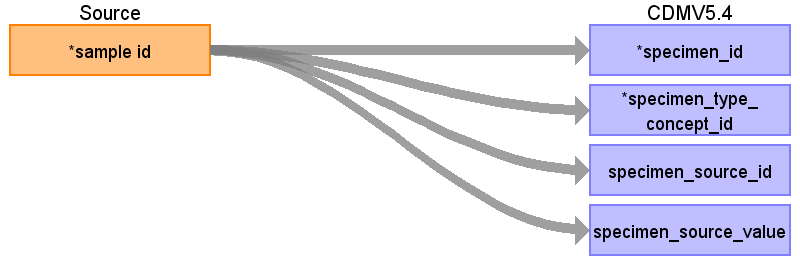

## Table name: specimen

### Reading from 0_coadread_tcga_pan_can_atlas_2018_clinical_data.tsv

| Destination Field | Source field | Logic | Comment field |
| --- | --- | --- | --- |
| specimen_id | sample id | Create one SPECIMEN per distinct Sample ID. |  |
| person_id |  |  |  |
| specimen_concept_id |  |  |  |
| specimen_type_concept_id | sample id | specimen_type_concept_id = 0 |  |
| specimen_date |  |  |  |
| specimen_datetime |  |  |  |
| quantity |  |  |  |
| unit_concept_id |  |  |  |
| anatomic_site_concept_id |  |  |  |
| disease_status_concept_id |  |  |  |
| specimen_source_id | sample id | specimen_source_id = [Sample ID] |  |
| specimen_source_value | sample id | specimen_source_value = [Sample ID] |  |
| unit_source_value |  |  |  |
| anatomic_site_source_value |  |  |  |
| disease_status_source_value |  |  |  |

